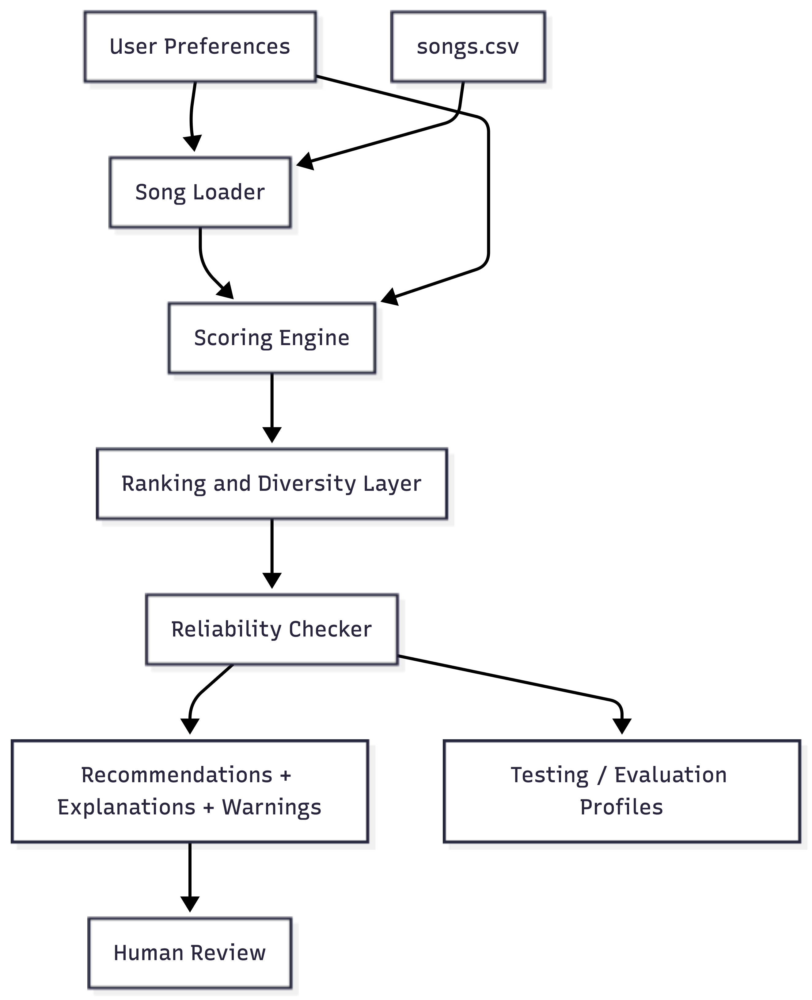

# Applied AI Music Recommender

## Project Summary

This project extends my earlier **Music Recommender Simulation (Module 3)** into a more reliable applied AI system.

The original project implemented a **content-based recommender** that ranked songs based on feature similarity (genre, mood, energy, tempo, and valence). It calculated a weighted score for each song and returned the highest ranked recommendations along with explanations.

This extended version adds a **reliability and testing layer** that evaluates recommendation quality, checks for contradictory user inputs, and logs system behavior to make the AI system more transparent and trustworthy.

---

## Why This Project Matters

Recommendation systems influence what people watch, read, and listen to every day. Even simple algorithms can produce convincing results, but they may also introduce bias or unreliable outputs.

This project demonstrates how to move from a simple prototype toward a **trustworthy AI system** by adding validation, guardrails, and explainability to the recommendation process.

---

## System Architecture

The system is organized as a modular pipeline where user preferences and song data flow through several components.



### Component Overview

**User Preferences**\
Input describing the user's taste (genre, mood, energy level, etc.)

**Song Loader**\
Loads the song catalog from `songs.csv`.

**Scoring Engine**\
Calculates similarity scores between user preferences and each song.

**Ranking and Diversity Layer**\
Ranks songs by score and applies a diversity penalty to avoid repetitive
results.

**Reliability Checker**\
Evaluates recommendation quality, detects contradictory preferences, and
assigns confidence warnings if needed.

**Output Layer**\
Displays final recommendations with explanations and reliability
messages.

**Testing / Evaluation Profiles**\
Predefined test profiles used to check consistency and system behavior.

**Human Review**\
Allows developers or users to inspect results and judge recommendation
quality.

---

## Setup Instructions

Clone the repository:

``` bash
git clone https://github.com/minh1608/applied-ai-music-recommender.git
cd applied-ai-music-recommender
```

Create a virtual environment (optional):

``` bash
python -m venv .venv
source .venv/bin/activate
```

Install dependencies:

``` bash
pip install -r requirements.txt
```

Run the recommender:

``` bash
python -m src.main
```

---

## Sample Interactions

### Example 1. High Energy Pop Listener

Input:

    genre = pop
    mood = happy
    energy = 0.9

Output:

    1. Sunrise City – Score: 6.18
       Reason: genre match, mood match, energy similarity

    2. Rooftop Lights – Score: 4.94
       Reason: mood match, energy similarity

---

### Example 2. Chill Lofi Listener

Input:

    genre = lofi
    mood = chill
    energy = 0.35

Output:

    1. Library Rain – Score: 6.50
       Reason: genre match, mood match, energy similarity

    2. Midnight Coding – Score: 5.72
       Reason: genre match, mood match, energy similarity

---

### Example 3. Conflicting Preferences

Input:

    genre = ambient
    mood = intense
    energy = 0.9

Output:

    Warning: user preferences may be contradictory.

    Recommendations returned with lower confidence.

---

## Design Decisions

Several design choices were made to keep the system understandable while improving reliability.

**Content-based filtering** was chosen because the dataset is small and does not include user listening history.

A **weighted scoring system** was used instead of machine learning to keep the model interpretable.

A **diversity penalty** was introduced to reduce repetitive recommendations from the same genre.

A **reliability checker** was added to detect contradictory preferences and provide warnings when recommendations may be weak or inconsistent.

These choices prioritize **transparency and explainability** over complexity.

---

## Testing Summary

The system was evaluated using several user preference profiles, including:

-   high-energy pop listeners
-   chill lofi listeners
-   rock listeners
-   conflicting preference profiles

Testing showed that the recommender produced consistent rankings for well-defined profiles. However, contradictory inputs sometimes produced weaker matches, which motivated the addition of the reliability checker.

---

## Reliability and Evaluation

The system was tested with four user profiles: High-Energy Pop, Chill Lofi, Deep Intense Rock, and a conflicting ambient-intense profile.

Clear and consistent profiles produced stronger recommendations and received **HIGH confidence** scores. For example, Chill Lofi and Deep Intense Rock both produced top recommendation scores above 6.0 and were labeled as high-confidence outputs.

The conflicting profile triggered warning messages because the requested genre, mood, and energy level did not align well. In that case, the system returned recommendations with **LOW confidence** and explicitly noted that the profile contained contradictory preferences.

This reliability layer makes the recommender more trustworthy by helping users understand not only what was recommended, but also how dependable those recommendations are.

---

## Reflection and Ethics

### Limitations and Bias

This recommender system has several limitations. The dataset is very small (18 songs), which means it cannot represent the full diversity of musical tastes. Because the scoring system relies mainly on structured attributes like genre, mood, and energy, it cannot capture deeper aspects of music such as lyrics, cultural context, or evolving listener preferences.

The scoring weights may also introduce bias. For example, energy similarity currently has the strongest influence on the final score. As a result, songs with similar energy levels may rank highly even if their genre or mood is less relevant. This demonstrates how small design decisions in recommendation algorithms can unintentionally shape the results users see.

### Potential Misuse

If a system like this were used in a real platform, it could reinforce narrow recommendation patterns or “filter bubbles.” Users might repeatedly receive music from the same genres or artists, reducing exposure to diverse content.

To reduce this risk, the system includes a **diversity penalty** that discourages recommending songs from the same artist or genre repeatedly. In real-world systems, additional safeguards such as diversity constraints, fairness monitoring, and regular auditing of recommendation outputs would also be important.

### Reliability Observations

Testing the system with different user profiles revealed an important pattern: when user preferences were clear and consistent, the recommender produced strong matches with high confidence scores. However, when the input preferences conflicted (for example, requesting ambient music with very high energy), the system produced weaker matches and triggered warning messages.

This experiment highlighted an important lesson: AI systems should not only produce predictions, but also communicate **how reliable those predictions are**.

### What This Project Taught Me

This project showed how even simple recommendation algorithms can feel intelligent when they combine structured data with ranking logic. At the same time, it reinforced the importance of reliability checks, transparency, and evaluation in AI systems.

Without guardrails and validation, recommendation systems can easily produce misleading outputs or reinforce bias. Designing systems that explain their reasoning and indicate their confidence is an important step toward building responsible AI applications.

### Collaboration with AI

AI tools played an important role during development. They helped generate code structure, suggest improvements to the scoring logic, and assist with debugging.

One particularly helpful suggestion from AI was the idea of adding a **confidence scoring layer** that evaluates recommendation strength and detects contradictory user preferences. This feature improved transparency and made the system behave more like a responsible AI application.

However, not all AI suggestions were correct. At one point, an AI-generated explanation assumed that certain features were used in the scoring algorithm even though they were not implemented in the code. This required manual verification and correction. This experience reinforced the importance of treating AI as a collaborator rather than a source of unquestioned answers.

---

## Portfolio Reflection

This project demonstrates my approach to building responsible AI systems. Rather than focusing only on prediction accuracy, I focused on transparency, explainability, and reliability. I extended a simple recommendation algorithm into a modular system that includes confidence scoring, contradiction detection, and evaluation logic.

This reflects how I think about AI engineering: building systems that are not only functional, but also understandable, testable, and trustworthy.